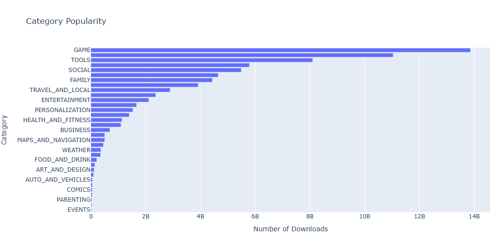

# Day 76: Analyzing Google Play Store Data
## Lesson Overview
**Day 76** analyzes Google Play Store data to gain an understanding of the following:
-	How competitive different categories are.
-	Which categories offer the most opportunity based on popularity
-	Paid vs free download numbers
-	How much should you be charging for an app
-	And more.

The day's lesson also introduces how to perform the following:
-	Remove duplicates quickly
-	Removing unwanted symbols and converting them to a number format
-	Dealing with nested columns
-	Creating vertical and horizontal bar charts
-	Creating pie and donut charts
-	Making scatter plots
## Project
### Project Files
#### Day76of100DaysofCode.ipynb
This file is the Python notebook used to complete this lesson. The file in this project folder is the completed notebook.
#### Apps.csv
This is the CSV file used to analyze app store data.
### Modules Used
#### Pandas
The **Pandas** library is used to gather data and explore the data from the **apps.csv file**.
#### Plotly
**Plotly** is used to create charts and visualize the data in this project.
### Project Walkthrough
#### Introduction
The notebook starts by importing Pandas and Plotly. In addition, floating-point numbers are formatted to display in the format of x.xx. With the formatting in place, the last prerequisite step is to read the CSV file and assign it to a variable.
#### Data Cleaning
The project proceeds to gather basic information about the data frame, including viewing the first few rows and identifying the columns used.

Data cleaning proceeds to drop the columns that will not be used in this project (Last_updated and Android_ver). NaN values are identified and removed from the data frame along with duplicate rows. 
#### Data Exploration
With the data frame cleaned up, the notebook proceeds to analyze data from the spreadsheet. Data analyzed includes:
-	Finding the highest-rated apps
-	Finding the largest apps
-	Finding the five apps with the most reviews
#### Data Visualization (Creating Pie Charts)
In this lesson instead of using MatPlotLib to visualize data, Plotly is used to create charts.

The first chart created is a chart that visualizes the content rating of apps in the App Store. A basic **pie chart** is first created but is then modified to create a pie chart that is easier to understand, as well as a **donut chart**.

#### Data Exploration (Numeric Type Conversion)
The next section in this notebook proceeds to analyze the number of application installations. The only problem is that the values are not numeric. To convert the numbers to a numeric value, commas are removed and then converted to numeric values using Pandas **to_numeric method**.

Another item that needs to be converted is the Price column. The values in that column include prices with a dollar sign. To work with that data, the dollar sign is dropped, and to_numeric is called to convert the value to a number.

With the data cleaned, the notebook proceeds to analyze the most expensive apps under $250, and the highest grossing paid apps.
#### Data Visualization (Creating Bar Charts, Scatter Plots, and Box charts)
The notebook proceeds to creating a vertical (top app categories) and a  **horizontal bar chart** (categories with the most downloads).

The next graph that is created is a **scatter plot** of the number of installations vs the number of apps in a category. First, a data frame is created that contains the number of apps and installs as columns. The graph that is produced has the installs on one axis and the number of apps on the other axis.

The next objective in this project is to extract nested data from a column. This is accomplished by using the split method on the Genres column to separate the apps that have multiple genres. A bar chart is then produced that has a **color scale** containing the top genres.

The next data point that is analyzed is seeing free vs paid apps by category. The graph that is created to visualize this data is a **grouped bar chart**.

Rounding out this lesson, the notebook finishes by creating **Box plots** using Plotly. The first box plot that is produced analyzes the number of app installs for free vs paid app installs. The second box plot created analyzes how much each app can earn based on the apps category.

