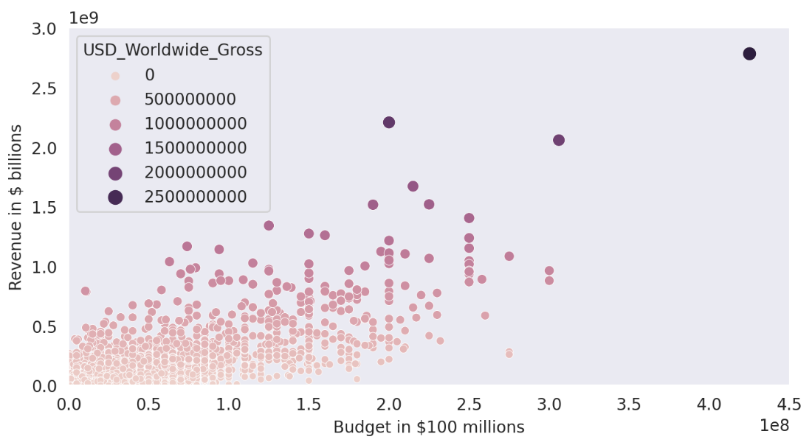
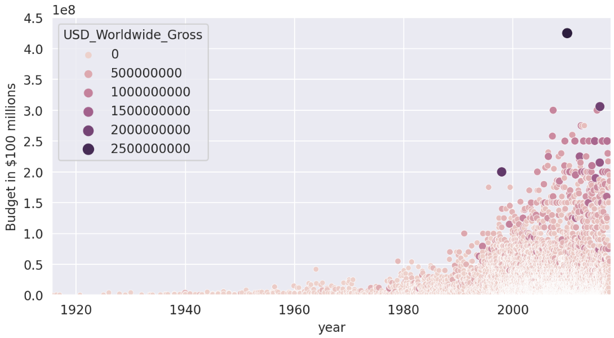
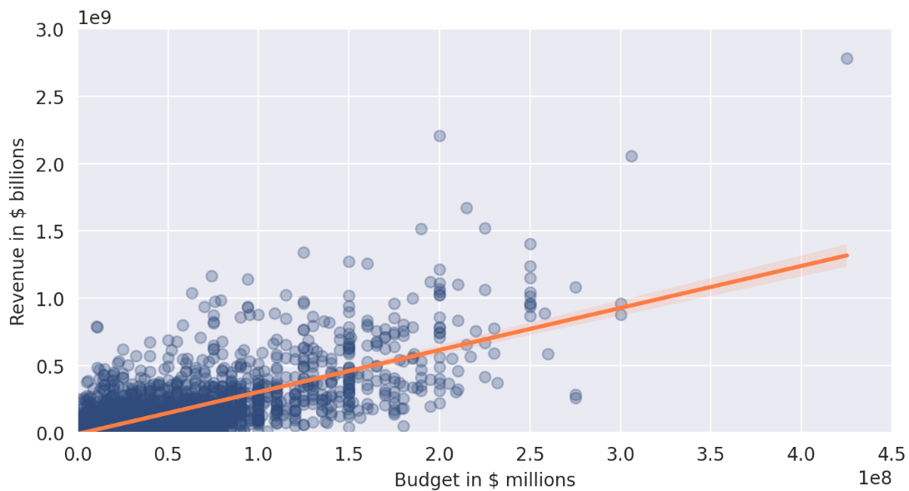

# Day 78: Analyzing Movie Budgets vs Revenue (Seaborn & Linear Regression)
## Lesson Overview
**Day 78** continues the data science portion of the course. The data set analyzed in today's lesson looks at film data that includes film budgets and revenues over time and asks questions such as Do higher film budgets lead to more revenue at the box office?  In addition, this lesson introduces scatter plots with **Seaborn** as well as making **linear regression** tests.
## Project
### Project Files
#### Day78of100DaysofCode.ipynb
This file is the main Python notebook used to complete this project. The notebook uploaded is the completed project.
#### Cost_revenue_dirty.csv
This file is the dataset that is analyzed in the Python Notebook. The data analyzed goes up to mid-2018.
### Modules Used
#### Pandas
**Pandas** is used to perform data analysis and exploration on the dataset associated with this project.
#### MatPlotLib
**Matplotlib** works in conjunction with Seaborn to create the plots used in this project.
#### Scikit-learn (LinearRegression)
**Sklearn** is used to run linear regression on the films dataset.
#### Seaborn
**Seaborn** is used for data visualization. Graphs created with Seaborn include bubble plots and regression plots.
### Project Walkthrough
#### Introduction
The project starts by importing the necessary modules and setting formatting options for pandas. The cost revenue dirty CSV file is also assigned to a variable called data.
#### Data Cleaning and Exploration
After getting the necessary prerequisites set up, the notebook proceeds to gather basic information about the spreadsheet. Data cleaning operations are also performed to check for NaN and duplicate values. 

The **USD_Production_Budget**, **USD_Worldwide_Gross**, and **USD_Domestic_Gross** columns are also reformatted as they contain dollar signs and commas in the values. Once those strings are dropped, the values are converted to numeric values. The **Release_Date** column is also converted into a datatime value. 

The next step in this project proceeds to gather descriptive statistics, which include the following:
-	What is the average production budget?
-	What is the average worldwide gross revenue?
-	Films that grossed 0 domestically and globally
-	Are the bottom 25% of films profitable?
-	What films had the highest production budget and gross revenue?
-	What film had the lowest budget?
#### Investigating Films that Have Zero Revenue and have lost money
With some basic analysis performed, the notebook proceeds to take a deeper dive into films that had zero revenue. 

There are various reasons why the films listed had zero revenue. One being that those films have never been released or are still in production. Other reasons could be that a film was released outside of the U.S. These questions are answered by filtering and sorting the data based on search criteria. This section also introduces the **query() Method** to retrieve the same information as using **loc()** with an & sign.

Additional queries are performed to locate films that have lost money and are get the total number of unreleased films
#### Data Visualization with Seaborn
With analysis of data complete, the next part of this notebook is to create graphs and visualize the data. The first graph created uses Seaborn to create a scatter plot. Various plots comparing film budgets vs revenue are created toggling with various features of Seaborn to see how data can be visualized. 

An additional scatter plot is created to visualize movie budgets over the years. The data plotted depicts a trend of growing movie budgets, and it is easy to identify when movie budgets skyrocketed. 

#### Adding a Decade’s Column and Regression Plots
The next section of this notebook adds a decade’s column. This column will be used to denote films released before 1969 and those released afterwards. This data was passed into two separate regression plots to compare film revenues vs film budgets of the “old films” vs the “new films”. Below is the screenshot of the Revenue and Budget of the “new films”

#### Running Regression with Scikit-Learn
Finishing up this notebook, scikit-learn is used to run a linear regression on the old_films data. An additional evaluation is performed and an evaluation of how much revenue a film with a budget of $350 will generate. 
