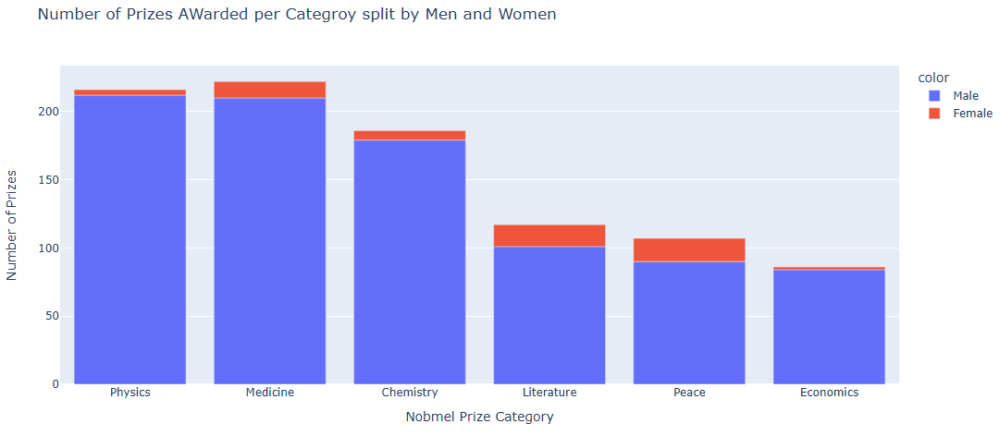
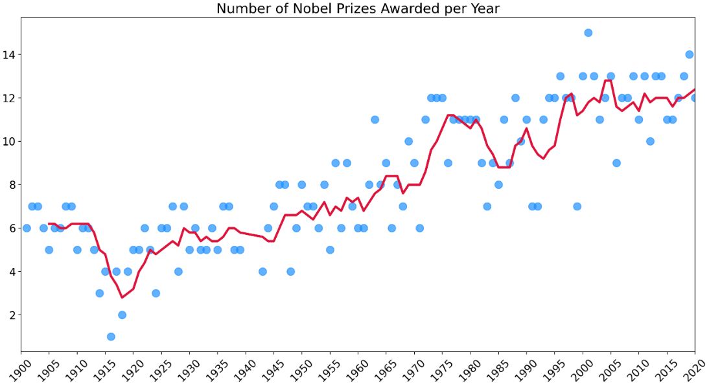
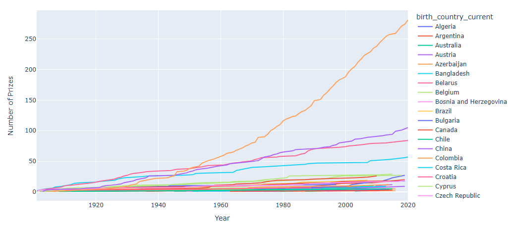
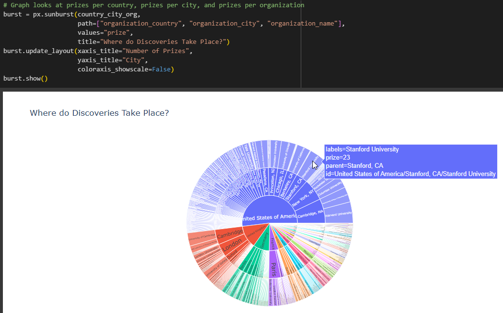
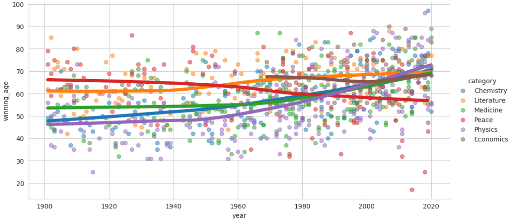

# Day 79: Nobel Prize Winner Analysis
## Lesson Overview
**Day 79** focuses on the analysis of Nobel Prize winners. This project reviews many concepts covered in the previous lessons and introduces new ones such as creating a Choropleth, sunburst charts, histograms and more.
## Project
### Project Files
#### Day79of100DaysofCode.ipynb
This file is the main Python notebook used to complete this project. The notebook uploaded is the completed project.
#### Nobel_prize_data.csv
This file is the dataset that is analyzed in the Python Notebook. 
### Modules Used
#### Pandas
**Pandas** is used to perform data analysis and exploration on the dataset associated with this project.
#### NumPy
**NumPy** is used to create an array of values used in a chart.
#### MatPlotLib
**Matplotlib** works in conjunction with Seaborn to create the plots used in this project.
#### Plotly
**Plotly** is used for data visualization and creating charts such as donut and bar charts.
#### Seaborn
**Seaborn** is used for data visualization. Graphs created with Seaborn include bubble plots and regression plots.
### Project Walkthrough
#### Introduction
The project starts by importing the necessary modules and setting formatting options for pandas. The nobel_prize_data.csv file is also assigned to a variable called data.
#### Data Cleaning and Exploration
The notebook proceeds to analyze the shape of the data frame as well as gathering information about the dataframe such as the column names, first values, last values and then proceeds to data cleaning. The dataset is checked for duplicate values and NaN values. Column values are also converted in this section. The **birth_date** values are converted to datetime values. Additionally, a column is added to display the prize share percentage. This percentage is calculated from the **prize_share** value. 
#### Visualization of Nobel Prize Winners by Gender and Category
The first chart plotted is a donut chart using plotly. However, to plot the chart, a breakdown of the gender of the winners first needs to be obtained using value_counts().

Additional data exploration is performed to see who the first female winners were. This section also answers the question whether there were repeat winners and looks at the total number of prizes for each category. A bar chart is created to depict the total number of prizes awarded historically.

This section finishes up by creating a bar chart that plots the breakdown of winners by gender for each category.

#### Visualizing the Number of Prizes Over Time
The next datapoint looked at is the number of prizes given out over time. The data returned displays that there is more prizes given out now then when the prizes were initially given out.

#### Visualizing Prizes by Countries
Proceeding to analyze the number of prizes received by each country, the following charts are produced.
-	Horizontal bar chart (total prize winners)
-	Choropleth
-	Bar chart breaking down prize winners by category
-	Line Chart depicting the number of prizes won over time by each country

#### Visualizing Top Research Institutes and Cities
The next chunk of data analyzed is to look at the top institutions that have won prizes. This data is depicted using a bar chart. In addition, a bar chart is created to depict the cities with the most prize winners. 

One interesting chart that is produced in this section is a sunburst chart depicting where discoveries take place in each country. Below is a screenshot of the code used to produce the chart along with the chart itself

#### Exploring and Visualizing Age of Individuals Who Receive Nobel Prize Award
The last chunk of data analyzed in this project is to look at the ages of prize winners. The section starts by looking at who the oldest and youngest winners were. Descriptive statistics such as the average age of winners is explored and a bar chart is produced depicting the age of all winners.

Additional charts are produced analyzing the average age of winners historically as well as the age of winners for each category awarded.

