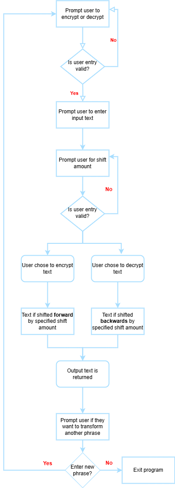

# Day 8 Project: Caesar Cipher
## Topics covered in leason include
Lesson builds on topics covered in the previous daily lessons and introduces new concepts.

This includes:
- Functions with arguments
- Positional arguements
- Keyword arguments
## Project
### Program Logic
1. The program first starts out by asking the user if they would like to encrypt or decrypt a text message. In order to proceed, the program only accepts encode or decode as a valid entry.
2. The user is then prompted for a text entry to encode/decode. This entry can be a single word or multiple words and include special characters. 
3. After entering a text phrase, the user must enter a number to specify the number of characters to shift each character. Since special characters are not in the alphabet, they are not shifted. Additionally, if a valid number is not entered, the user is informed and prompted to enter a valid number.
4. Depending on whether the user chose encode or decode, the program will proceed and shift the characters in the text phrase that was passed in. If encode was selected, letters are shifted forward. If decode was selected, letters are shifted backwards.
5. The output text is then returned to the user.
6. The user is then prompted to see if they want to enter another word to encrypt/decrypt. If the user selects yes, the program is restarted. If the user selects no or enters an invalid entry, the program is exited.
### Diagram
