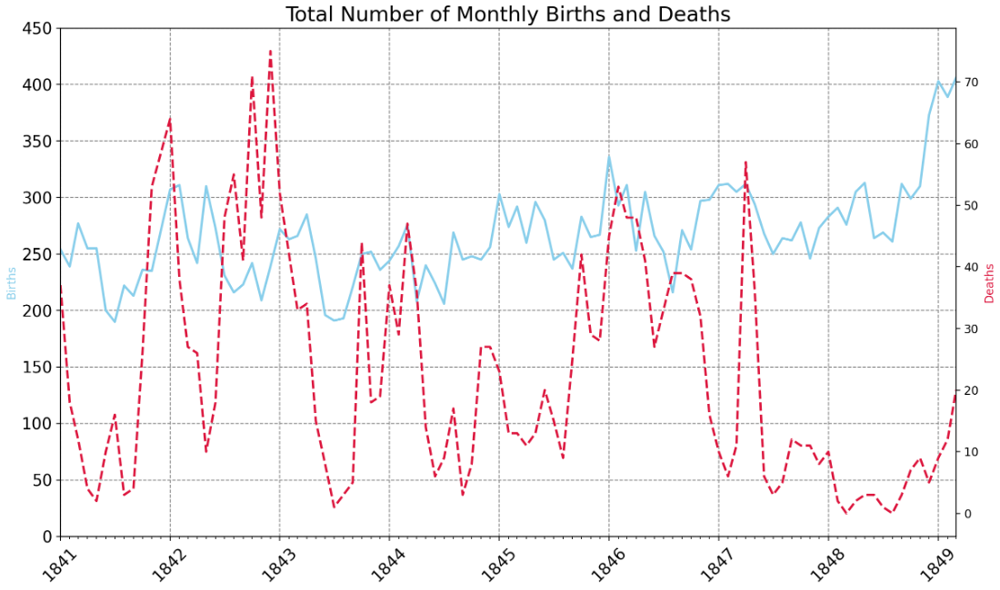
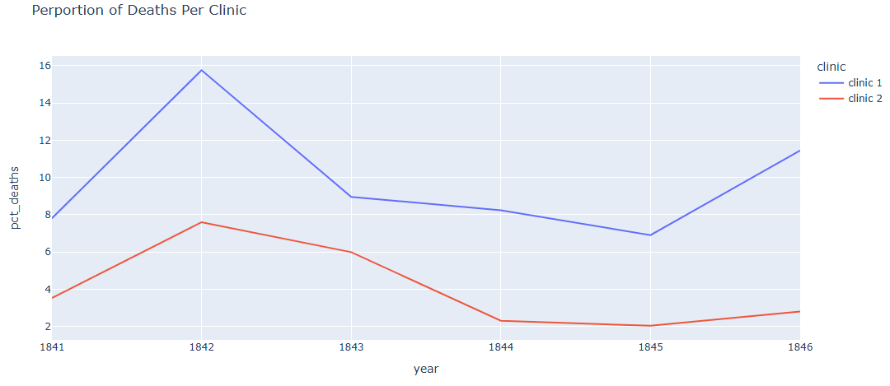
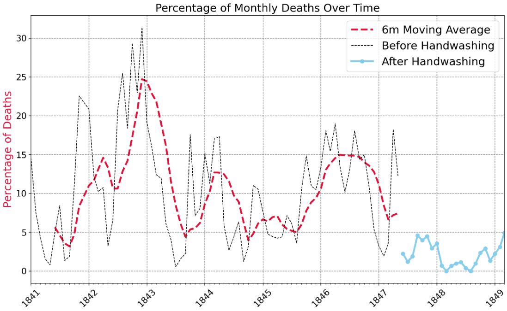
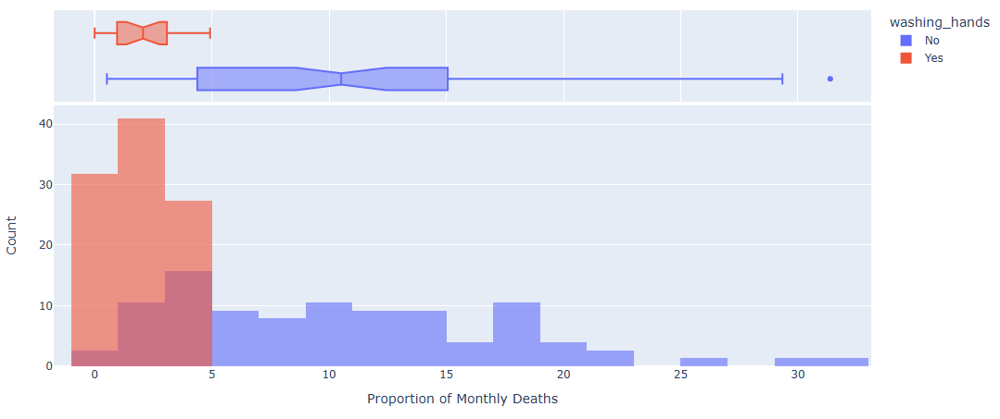

# Day 80: Analysis of Handwashing and Preventing the Spread of Illnesses
## Lesson Overview
**Day80** is the last non-capstone project of the course and the last lesson on data science. This project analyzes the importance of hand washing and preventing the spread of illness. Particularly, the project looks at data from Dr Ignaz Semmelweis on figuring out why women in maternity wards were dying from puerperal fever. 
## Project
### Project Files
#### Day80of100DaysofCode.ipynb
This file is the main Python notebook used to complete this project. The notebook uploaded is the completed project.
#### Data folder
The data folder contains the CSV file used within the Python Notebook. 
### Modules Used
#### Pandas
**Pandas** is used to perform data analysis and exploration on the dataset associated with this project.
#### NumPy
**NumPy** is used to perform a conditional operation on an array.
#### MatPlotLib
**Matplotlib** works in conjunction with Seaborn and Plotly to create the plots used in this project.
#### Plotly
**Plotly** is used for data visualization and creating charts such as line and box charts.
#### Seaborn
**Seaborn** is used for data visualization. Graphs created include a kernel density plot.
#### Skipy
**Skipy** is used to perform a T-Test at the end of the notebook.
### Project Walkthrough
#### Introduction
The notebook begins by importing the necessary modules, setting formatting options for pandas, and assigning the two CSV files used for data analysis to variables.
#### Preliminary Data Exploration
Preliminary data exploration is performed on the data frames to gather the following:
-	The shape of the data frames
-	Column names
-	Years of the data sets
-	Checking for NaN values
-	Average number of births and deaths per month
#### Visualizing Total Number of Births and Deaths
The first data point visualized is the total number of births and deaths per month. This is accomplished with Matplotlib to create a line chart with multiple lines. The chart depicts deaths going down in 1847 with births steadily going up.

#### Data Split by Two Clinics
The next data point analyzed is the total number of births and deaths at the two separate clinics. Separating the two clinics depicts dramatic differences in the total number of deaths. One clinic has a significantly higher number of deaths than the other.

This data is depicted using two separate line charts. One chart depicts the number of births, which shows that births have similar trajectories, while the chart depicting deaths shows that one clinic has significantly more deaths than the other.

An additional data point is added. The percentage of births resulting in deaths is calculated and plotted using a separate line chart as depicted below. 

#### Analyzing the Effect of Handwashing
In June 1847, Dr Semmelweis made handwashing mandatory. The Monthly data frame is modified to include a column called pct_deaths. Two separate subsets are created from this data frame to analyze the data before and after June 1847. The statistics show that the percentage of deaths was about 10% before the date, and around 2% after the date.

A line chart is created to depict the percentage of deaths before and after the cutoff date. The chart created has three lines; before handwashing, after handwashing, and the 6-month moving average before handwashing.

The dataset then looks at statistics of deaths before and after handwashing. A Box plot is then created to depict these statistics.

One of the other charts created to show the effects of handwashing is a histogram.

Rounding out the charts created to analyze handwashing, Seaborn is used to create a Kernel Density Estimate and visualize a distribution of data. Two separate KDEs are created, one before handwashing and one after handwashing.

The last bit of data that is analyzed in this project is to perform a T-Test to show if the results are by chance or statistically significant. The t-test is performed by using stats from the scipy library.
