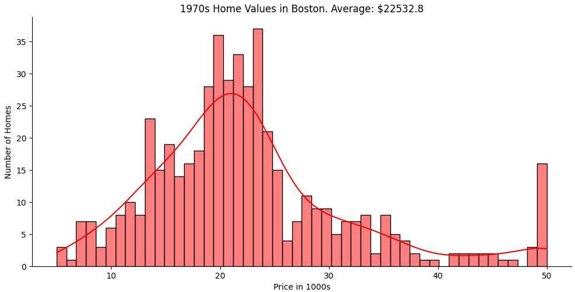
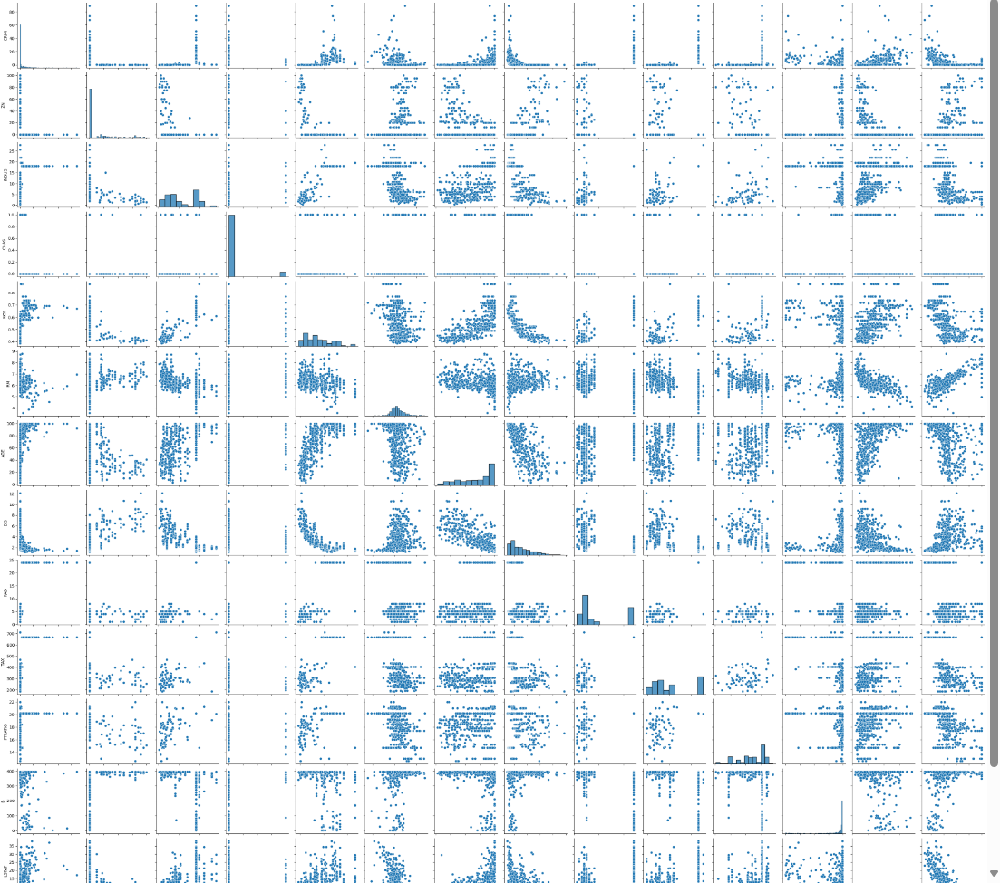
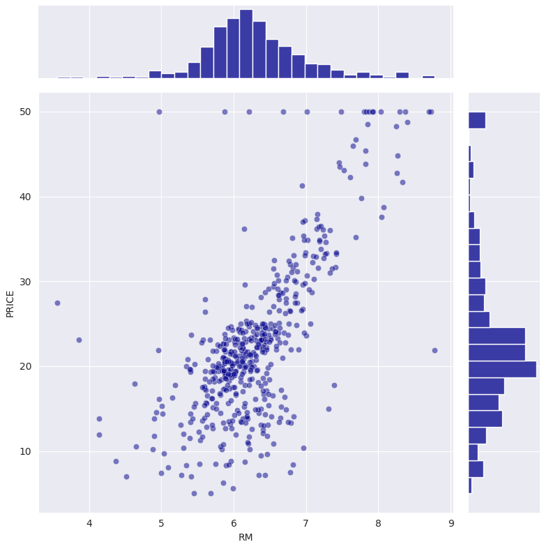
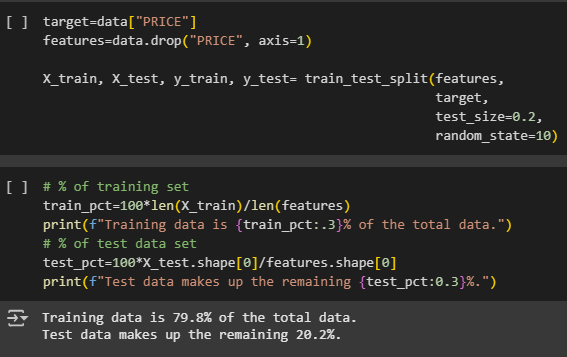
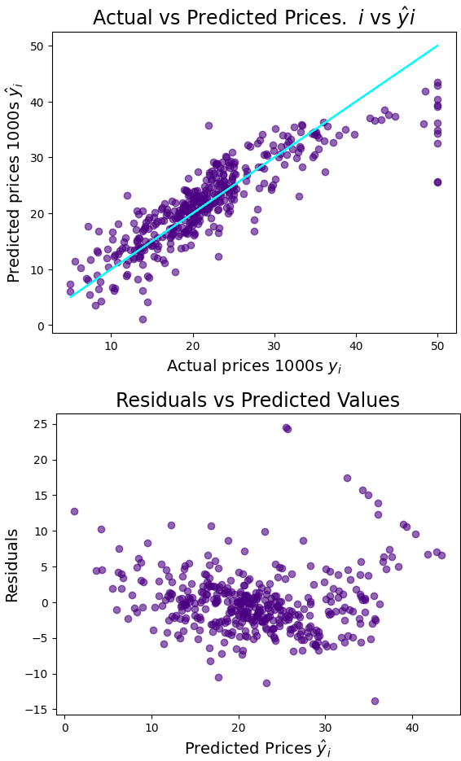

# Day 81: Predicting Housing Prices Capstone
## Lesson Overview
**Day 81** is the capstone project for the data science portion of the course. This project analyzes housing prices in Boston in the 1970s. The project puts you in the shoes of a real estate development company wanting to build a model that can help provide a price estimate based on home characteristics in the Boston area.

Data points analyzed include:
-	Number of rooms
-	Distance to employment centers
-	Wealth of areas
-	Students per teacher in local schools

The project performs the following tasks.
1.	Analyze and explore the Boston house price data
2.	Splits data for training and testing
3.	Runs a multivariable regression
4.	Evaluates how the model’s coefficients and residuals
5.	Uses data transformation to improve model performance
6.	Uses the model to estimate a property price
## Project
### Project Files
#### Day81of100DaysofCode.ipynb
This file is the main Python notebook used to complete this project. The notebook uploaded is the completed project.
#### Boston.csv
This is the dataset used in this project. 
### Modules Used
#### Pandas
Pandas is used to perform data analysis and exploration on the dataset associated with this project.
#### NumPy
NumPy is used to perform a conditional operation on an array.
#### MatPlotLib
Matplotlib works in conjunction with Seaborn and Plotly to create the plots used in this project.
#### Plotly
Plotly is used for data visualization and creating bar charts.
#### Seaborn
Seaborn is used for data visualization. Graphs created include joint plots.
#### Sklearn
Sklearn is used to perform a linear regression.
### Project Walkthrough
#### Introduction
The notebook begins by importing the necessary modules, setting formatting options for pandas, and loading the CSV file.
#### Preliminary Data Exploration & Cleaning
This section of the notebook starts by gathering information about the dataset, such as its size and column names. Additionally, data cleaning operations are performed by checking if the dataset has any NaN or duplicate values.

The next challenge tackled is to identify descriptive statistics about the data being worked on. The information analyzed includes the following:
-	Number of students per teacher on average
-	Average price of a home in the dataset
-	Minimum and maximum number of rooms in homes

This section also contains charts on this data, including bar charts depicting the price of homes, the distance of homes to employment centers, the distribution of rooms, accessibility to highways, and the number of properties located next to the river.

#### Understanding Relationships in the Data
In this section, several graphs are created to visualize the data being analyzed. The graphs created include:
-	Joint plots
-	Pair plot

The first plot created is the pair plot depicted below. 

The following plots created in this section include joint plots that depict the following:
-	Distance from employment vs nitric oxide pollution
-	Proportion of non-retail industry vs nitric oxide pollution
-	Proportion of lower-income population vs number of rooms
-	Lower-income population vs home prices
-	Number of rooms vs home value

Below is a graph depicting the number of rooms compared to the home's value.

#### Split Training and Test Datasets
This section starts by importing the train_test_split function form sklearn. The section then creates 4 subsets, X_train, X-test, y_train, and y_test. This information is used for the following sections. 

#### Multivariable Regression
This section runs a regression on the data subsets that are generated from the previous section. This data is then analyzed, and graphs are produced from the data. 

A second regression is created using Log prices. The output of this regression is explored, and graphs are created to visualize the data.
#### Compare Out-of-Sample Performance
This section compares how the regressions perform on data that was not included as part of the regressions. To analyze this data, the X_test subset is used. 
#### Predict a Property’s Value Using the Regression Coefficients
Finishing up this notebook, property values are compared using the statistics generated from the regression coefficients.
