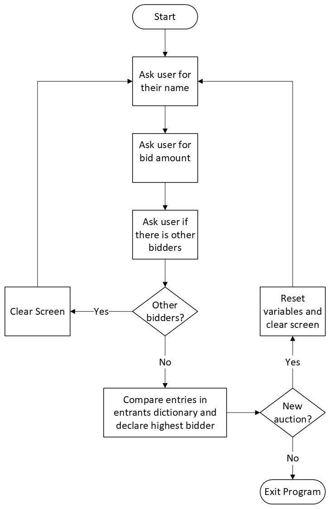

# Day 9 Project: Silent Auction
## Topics covered
The lessons covered in day 9 of the 100 Days of code course include the following:
- Introduction to Python dictionaries
- Nested lists and dictionaries
## Project
### Program Walk Through
The silent auction program first starts by prompting the user for their name. Afterwards they are prompted for a bid amount. After entering a bid, the user is asked if there are any additional bidders. If there are any additional bidders, the screen is cleared, and this process is repeated until there are no more additional bidders. Bidders are added to a dictionary called **entrants** to keep track of the entrant’s name and bid amount.

Once all the entrants have been entered, the program proceeds to compare who has bid the highest amount. This is accomplished using a for loop. If a user’s bid is higher than the previous highest bid, which starts at 0, then their name and bid amount are added to the variables called **highest_bidder**, and **highest_bid**. Once every bidder is evaluated, then the name of the highest bidder and their bid amount are returned to declare a winner.

To add the ability to replay the program, the user is prompted if they would like to start a new auction. If the user selects yes, then the programs variables are reset, and the auction process is started again. If the user selects no or an invalid entry, then the program is exited.
### Diagram
