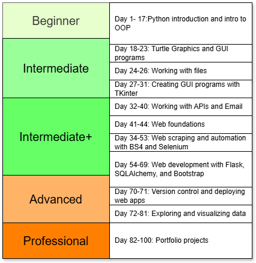

# 100 Days of Code Udemy Course Projects
## Introduction
This repository was created to refresh the knowledge learned from the 100 Days of Code course taught by Angela Yu on UDemy. I previously completed this course; however, at that time, I did not upload any of the projects to GitHub outside of the portfolio projects. The portfolio projects for the course are created under their own repository and have a prefix of **100DaysofCode**. This repository focuses on the projects from days 1 through 81.

Why upload the daily projects and retake this course? For me, I had the following goals in completing this repository:
-	Refresh my knowledge of the concepts covered in the course.
-	Gain additional practice working with Python 
-	Practice using Git and version control, 
-	Demonstrate my documentation skills. Each project within this project has an associated **README file**.

For anyone interested in the course, the course can be found on [uDemy](https://www.udemy.com/course/100-days-of-code/).
## Course Sections

The course begins assuming someone taking the course has zero experience working with Python. At a high level, the sections of the course are broken down into **beginner**, **intermediate**, **intermediate+**, **advanced**, and **professional**. Of the levels listed, the professional projects are not in this repo as they are the portfolio projects created in days 81-100.

The projects can also be broken down into the following sections.

### Days 1-17: CLI Projects and Introduction to Python Programming
The projects in this section introduce Python programming basics such as variables, data types, and loops. As the lessons progress, **object-oriented programming** is introduced. All the programs created in this section are CLI programs. 

### Days 18-23: Turtle Graphics and Creating GUI Programs
The projects in this section introduce working with GUI interfaces and external libraries. Primarily, **Turtle Graphics**. Building on the concepts of OOP, the projects create classes in external files that are imported into main.py. Some of the games created in this section include the **Snake** game, **Pong**, and the **Turtle Crossing capstone**.

### Days 24-26: Working with Files
The projects in this small section focus on interacting with files. These files include text files as well as CSV files using the csv library and a brief introduction to the **Pandas library**.

### Days 27-31: Creating GUI programs with TKinter
This group of projects focuses on working with the **TKinter** library. These projects also combine the knowledge learned from working with files to provide ‘persistent storage’. Some of the projects produced in this lesson include a **Pomodoro timer** and a **Flaskcard application**.

### Days 32-40: Working with APIs
Breaking into the intermediate+ course projects, the section first introduces the **smtplib** library, which is essential for future projects in this course.

In addition to sending emails, the projects in this chunk focus on working with API endpoints. Both endpoints that do not require authentication and those that do. Some of the API projects produced in this section include the following:
-	Stock trend tracker
-	Habit tracking
-	Flight deal alerts and notifications (capstone)

### Days 41-44: Web Foundations
This section of projects takes a break from working with Python and focuses on **HTML** and **CSS**. Having a basic understanding of these concepts is essential for the web scraping and web development sections of the course.

### Days 45-53: Web Scraping and Automation with Beautiful Soup and Selenium
This section of projects introduces web scraping and automation. The first few projects focus on working with **Beautiful Soup** and web scraping. Since websites are always changing, some of the websites scraped here are static web pages.

**Selenium** is then introduced to automate tasks such as playing an online game, automatically applying to jobs, and gathering rental data to be uploaded into an online form. 

### Days 54-69: Web Development with Flask, SQLAlchemy, and the Bootstrap Framework
The web development section of the course focuses on working with **Flask**. Additionally, the Bootstrap Framework is introduced to make visually appealing websites. Persistent storage in the form of **SQLite** databases is also introduced in this section, and **SQLAlchemy** is used to interact with those databases.

There are various websites created in this section; however, the main website that’s produced and enhanced in 5 (4.5ish) different iterations is a **Blog website**. This website is produced using a **Bootstrap template**, and functionality is added to it in the subsequent iterations of the project.

### Days 70-71: Version Control and Deploying Web Apps
These two days provide a break from Python programming and introduce **Git** and **version control**, as well as deploying the Blog Capstone project to a live website from a GitHub Repo.

### Days 72-81: Exploring and Visualizing Data with Pandas
These projects return to working with Pandas and utilize Python Notebooks to execute the data exploration and visualization performed. Additionally, these projects are all completed online using **Google Colab**, but can also be completed offline using a Jupyter Notebook. 

These projects work with libraries such as **Pandas**, **MatPlotLib**, **Numpy**, Seab**orn, and others to explore data in datasets that are associated with the daily project. Some of the datasets analyzed include:
-	Benefits of handwashing
-	Nobel prize winners
-	Movie budgets vs revenues
## Projects Highlighting Documentation Abilities
Every project completed in this course has an associated README file. Several of the projects have flow charts, images and screenshots associated with the project. In addition, each project provides a walkthrough of the code and what the project achieves. The following projects are ones that include some of the most thorough documentation (in my opinion  ). The projects listed are all the capstone projects, however as the course advanced, more detailed documentation was created.
1.	[Day 11 Capstone: Black Jack Game](Day11-Capstone-Blackjack)
2.	[Day 23 Capstone: Turtle Crossing GUI Game](Day23-Capstone-TurtleCrossing)
3.	[Day 31 Capstone: Flashcard App](Day31-Capstone-FlashCardApp)
4.	[Day 39-40: Capstone: Flight Finder](Day39-40-Capstone-FlightFinder)
5.	[Day 53 Capstone: Data Entry Bot](Day53-Capstone-DataEntryBot)
6.	[Day 69 Capstone: Blog Website Part 4](Day69-Capstone-BlogSitePt4)
## Portfolio Projects
The portfolio projects were completed previously before tackling the goals I had for this repository. This section links out to those projects. Each of those projects should have documentation associated with the project as well.
-	[Day 82: Morse Code Program](https://github.com/briansalazar-tech/100DaysofCode-Morse-Code-Program)
-	[Day 83: Portfolio Website](https://github.com/briansalazar-tech/100DaysofCode-Portfolio-Website)
-	[Day 84: Tic Tac Toe CLI Game](https://github.com/briansalazar-tech/100DaysofCode-Tic-Tac-Toe)
-	[Day 85: TKinter Watermarking Website](https://github.com/briansalazar-tech/100DaysofCode-TKinter-Watermarking-App)
-	[Day 86: Typing Speed Test Applicaiton](https://github.com/briansalazar-tech/100DaysofCode-Typing-Test-App)
-	[Day 87: Breakout Video Game Clone](https://github.com/briansalazar-tech/100DaysofCode-Breakout-Game)
-	[Day 88: Updated Coffee Shop](https://github.com/briansalazar-tech/100DaysofCode-Updated-Coffee-Shops-Site)
-	[Day 89: New Years Goal (To-Do) Website](https://github.com/briansalazar-tech/100DaysofCode-New-Years-Goals)
-	[Day 90: Disappearing Text App](https://github.com/briansalazar-tech/100DaysofCode-Disappearing-Text-App)
-	[Day 91: PDF to Audio File](https://github.com/briansalazar-tech/100DaysofCode-PDF-to-Audio)
-	[Day 92: Color Palette Website](https://github.com/briansalazar-tech/100DaysofCode-Color-Palette-Site)
-	[Day 93: Web Scraping Homes for Sale](https://github.com/briansalazar-tech/100DaysofCode-Web-Scraping)
-	[Day 94: Automated Google Dinosaur Game](https://github.com/briansalazar-tech/100DaysofCode-GUI-Automation)
-	[Day 95: Space Invaders Clone](https://github.com/briansalazar-tech/100DaysofCode-Space-Invaders-Clone)
-	[Day 96: Ski Resort Weather API Website](https://github.com/briansalazar-tech/100DaysofCode-Ski-Resort-Weather-API-Website)
-	[Day 97: Online Shop](https://github.com/briansalazar-tech/100DaysofCode-Online-Shop)
-	[Day 98: Python Automation (Email Weather Data)](https://github.com/briansalazar-tech/100DaysofCode-Python-Automation)
-	[Day 99: Space Race Analysis](https://github.com/briansalazar-tech/100DaysofCode-Space-Race-Analysis)
-	[Day 100: Fatal Force Analysis](https://github.com/briansalazar-tech/100DaysofCode-Fatal-Force-Analysis)

